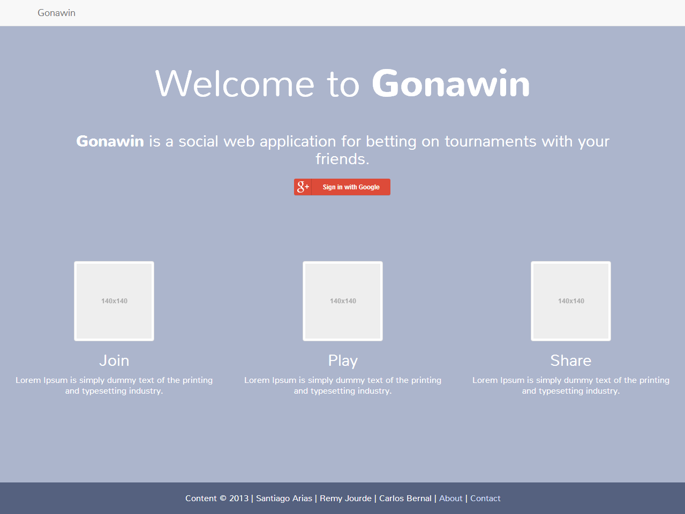
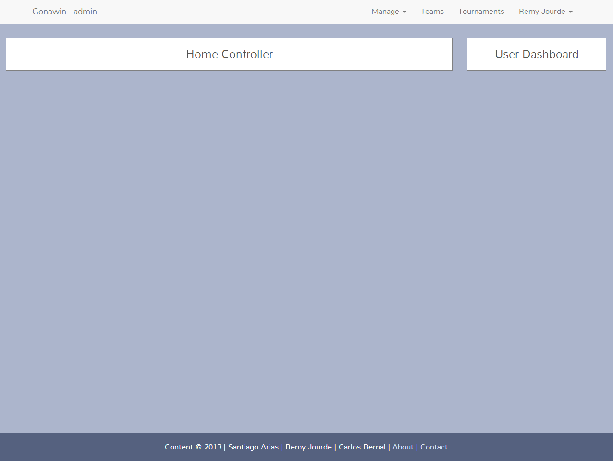
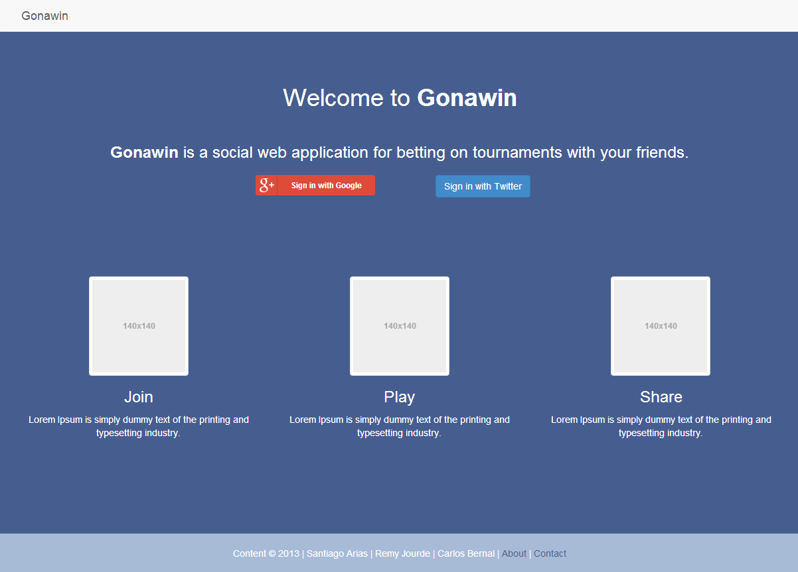

Gonawin themes
===================

naming convention:
     
     [adjective-plant]

please detail:

 * the colors you customize
 * the fonts you use
 * images of main page, teams page, team page and user page.
 
how to add a new theme:

 * copy main_crazy_rose.css
 * edit your CSS with your values
 * set your css file in index.html

List of Themes:
---------------
crazy-rose (main_crazy_rose.css):

      body background-color: #ACB5CC
      footer background-color: #55617F
      font: Nunito
      

dirty-lily (main_dirty_lily.css):

      body background-color: #465E8F
      footer background-color: #A7BBD6
      

